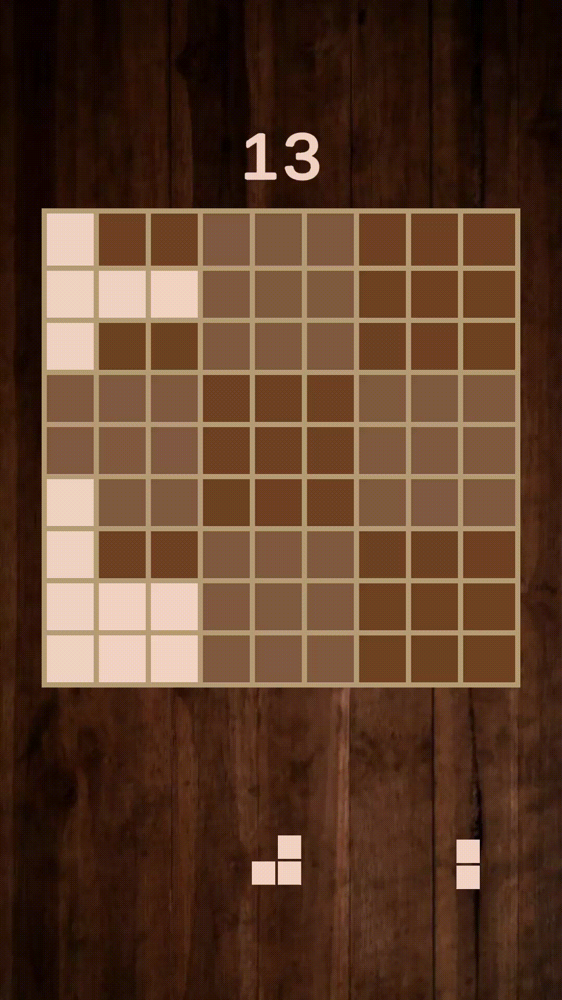

### Block Puzzle Game

**Unity : 2022.3.18f1**

**Description:**
Block Puzzle Game is a captivating puzzle experience where you strategically place blocks on a 9x9 board. Your goal is to fill rows, columns, or squares to clear them from the game and achieve the highest score.

**Features:**
- Engaging puzzle gameplay with a 9x9 grid.
- Strategic block placement to clear rows, columns, or squares.
- Beat your high score by earning as many points as possible!

**How to Play:**
1. Drag shapes onto the board to place them in the grid.
2. Fill a row, column, or square to clear blocks.
3. Aim for the highest score and play for as long as you can!

**Getting Started:**
1. Check ["Releases"](https://github.com/srggrigorov/block-puzzle-game/releases/tag/Android) tab to find the .apk file.
2. Download file and put it to your Android device storage.
3. Run the file, install the game and enjoy!

---

### Block Puzzle Game

**Unity : 2022.3.12f1**

**Описание:**
Block Puzzle Game - захватывающий пазл, в котором вы стратегически размещаете блоки на доске 9x9. Ваша цель - заполнять ряды, столбцы или квадраты, чтобы очистить их от игры и достичь наивысшего счета.

**Особенности:**
- Захватывающий игровой процесс с сеткой 9x9.
- Стратегическое размещение блоков для очистки рядов, столбцов или квадратов.
- Побейте свой рекорд, зарабатывая максимальное количество очков!

**Как играть:**
1. Перетащите формы на доску, чтобы разместить их в сетке.
2. Заполните ряд, столбец или квадрат, чтобы очистить блоки.
3. Стремитесь к наивысшему счету и играйте так долго, как сможете!

**Начало игры:**
1. Проверьте вкладку ["Релизы"](https://github.com/srggrigorov/block-puzzle-game/releases/tag/Android) для поиска .apk файла.
2. Скачайте файл и поместите его в хранилище вашего Android-устройства.
3. Запустите файл, установите игру и наслаждайтесь!

